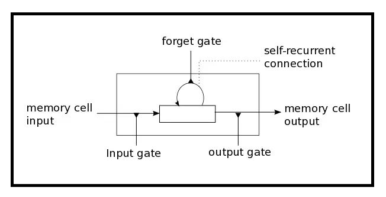

# Group_A_Allstarz
## ALLSTARZ INTRO

**Viseth Auk**

**Toby Martin**

**Simon Zhang**

**Luke Macumber**

The Question is:  Can we utilise ML to accurately predict entry and exits signals whilst trading, in order to make a consistent profit?

LSTM vs SMA vs Buy & HODL

Compare and contrast buy & HODL, MA trading and LSTM (close price)

# LSTM Model and Its Application in the Financial Markets 

In many research publications there has been a lot of discussions around a new trading phenomenon used in various trading strategies known as the LSTM Model, often referred to as the Long-Term Short-Term Memory Model which is used in the neural network or machine learning arena. We would like to uncover the truth behind this style of trading, is it truth or fiction?

 In previous works we have seen much of the hype surrounding neural networks and its applications more focused in image-based applications such as fingerprint recognition, facial recognition, etc.
However, models in **Recurrent Neural Networks** (RNNs) have been successfully used in recent years to predict future events in time series as well. RNNs have contributed to breakthroughs in a wide variety of fields centered around predicting sequences of events. The reason they work so well is because LSTM is able to store past information that is important, and forget the information that is not. 
    
  LSTM has three gates:
- The **Input Gate**: The input gate adds information to the cell state
- The **Forget Gate**: It removes the information that is no longer required by the model
- The **Output Gate**: Output Gate at LSTM selects the information to be shown as output

  The diagram below illustrates the gate setup: 

    

 In this project, we will explore and demonstrate how one type of RNN model, the **Long Short-Term Memory (LSTM)** network, can be used to predict price movement in financial time series data which is considered to be perhaps the most chaotic and difficult of all time series. We will also seek to use technical indicators such as the Moving Average and the MACD with LSTM to try and predict price movements and profit from it in our strategy.

# Definitions

Before we dive into it let's understand some terminologies commonly used in the model

- **Features**  : The feature / object we gonna use to predict the next price value.
- **Dropout**   : The dropout rate is the probability of not training a given node in a layer.This helps the model to not overfit our training data.
        
- **Optimiser** : Optimisation algorithm to use (defaults to Adam).
- **Batch Size**: The number of data samples to use on each training iteration.
- **Epoch**     : The number of times that the learning algorithm will pass through the entire training dataset
- **HODL**     : Hold On For Dear Life

# Data Exploration

The data we will be working with will be daily data of cryptocurrencies. We will be focusing on the prices of BTC, if we have time
we could look at other cryptocurrencies. Our intention is to see if LSTM can be used to predict market price changes and if it is 
possible to incorporate this model to profit from in our trading strategies. The data is taken from **coinmarketcap.com** and extracted into a CSV file

# Data Visualisation

We need to inspect and see what sort of data we have we expect to see data with various patterns occurring overtime
to ensure that the data can account for different changes in market behaviour over the period. This ensure consistency and trust 
that the data have enough coverage for the forever changing market conditions.

# Define the Features
The feature column we want to use to predict is the closing price.

# Split the Data for Training Sets

# Scale the Data
We scale the data so it is uniform and comparable

# Re-Shape the Data

# Build the LSTM Model

# Train the Data

# Evaluate the model

